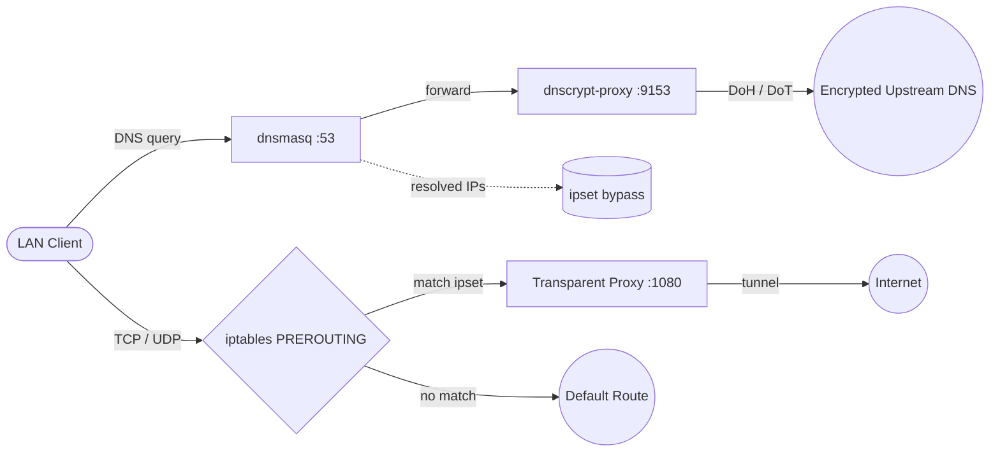

# netshunt

Selective traffic routing through a transparent proxy for Keenetic routers.

netshunt routes specific domains, IPs, and CIDRs through a transparent proxy while everything else uses the default connection. It runs on Keenetic routers with [Entware](https://github.com/Entware/Entware) and manages the entire split-tunneling pipeline: DNS resolution, ipset population, and iptables redirection.

## Features

- **Group-based routing** — organize domains, IPs, and CIDRs into named groups, enable/disable entire groups at once
- **Web dashboard** — manage groups, view status, adjust settings, run diagnostics
- **CLI** — full command-line interface for scripting and automation
- **Encrypted DNS** — dnsmasq → dnscrypt-proxy for DoH/DoT upstream resolution
- **Automatic IP tracking** — dnsmasq populates ipset in real-time at DNS query time
- **TCP + UDP** — NAT REDIRECT for TCP, TPROXY for UDP
- **Keenetic integration** — NDM hooks restore rules on reboots, WAN changes, interface restarts
- **Proxy-agnostic** — redirects to a local port, any transparent proxy works

## How It Works



## Quick Start

```sh
# Download the latest IPK from GitHub Releases
opkg install netshunt_x.x.x_aarch64.ipk

# Run the interactive setup wizard
netshunt setup

# Add domains
netshunt add example.com netflix.com

# Open the web UI at http://<router-ip>:8080
```

## Requirements

- Keenetic router with Entware (aarch64)
- A transparent proxy listening on a local port (e.g. Shadowsocks, xray, sing-box, Hysteria 2)
- SSH access to the router

System dependencies (`ipset`, `iptables`, `ip-full`, `dnsmasq-full`, `dnscrypt-proxy2`) are installed automatically as opkg dependencies.

## Building from Source

Requires Go 1.24+ and [Mage](https://magefile.org/).

```sh
# Build for host platform
mage build

# Cross-compile for router (aarch64)
mage buildRouter

# Build IPK package
mage package

# Run tests
mage test
```

## Documentation

Full documentation is available in the [Wiki](https://github.com/egorlepa/netshunt/wiki):

- [Prerequisites](https://github.com/egorlepa/netshunt/wiki/Prerequisites) — router requirements, proxy setup
- [Installation](https://github.com/egorlepa/netshunt/wiki/Installation) — IPK install, manual install
- [Setup](https://github.com/egorlepa/netshunt/wiki/Setup) — interactive setup wizard walkthrough
- [CLI Reference](https://github.com/egorlepa/netshunt/wiki/CLI-Reference) — all commands, flags, examples
- [Configuration](https://github.com/egorlepa/netshunt/wiki/Configuration) — config.yaml and groups.yaml schema
- [Architecture](https://github.com/egorlepa/netshunt/wiki/Architecture) — system design and internals
- [Troubleshooting](https://github.com/egorlepa/netshunt/wiki/Troubleshooting) — common issues and diagnostics

## License

MIT
